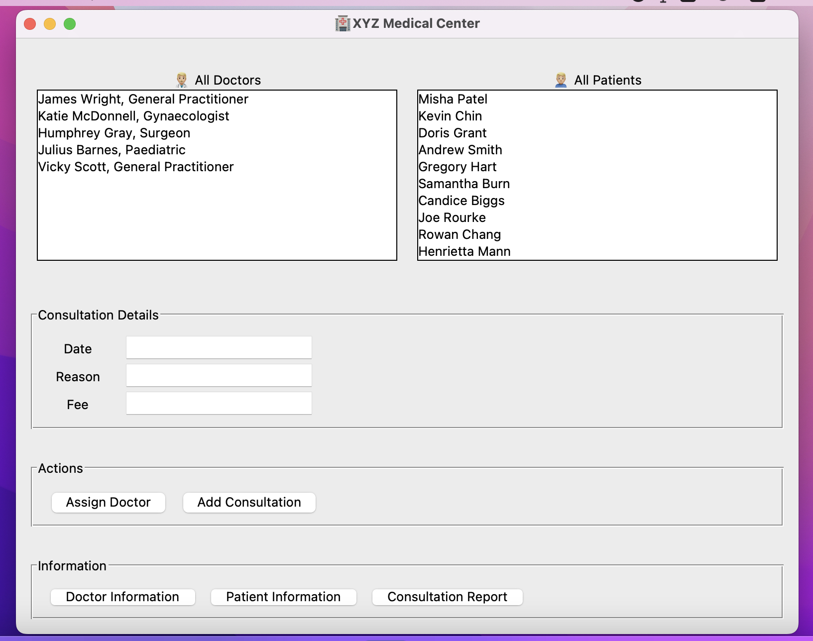
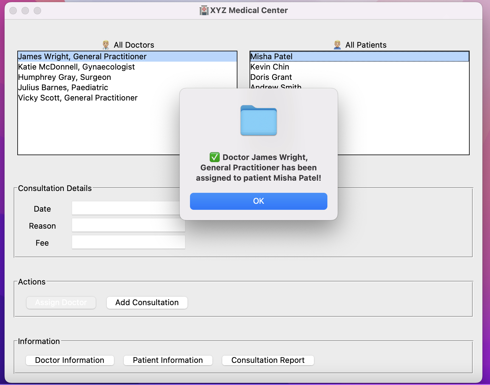
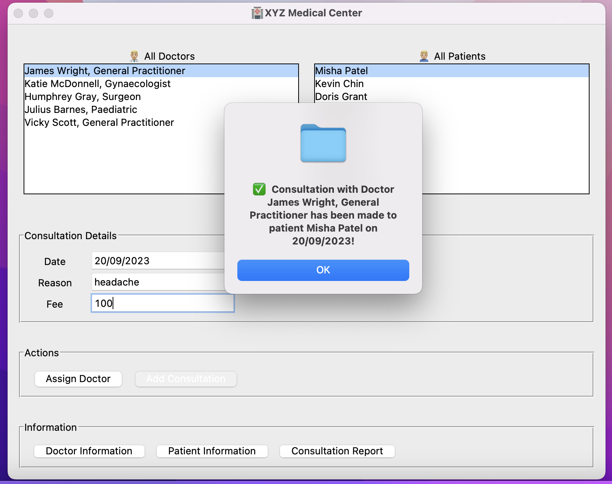
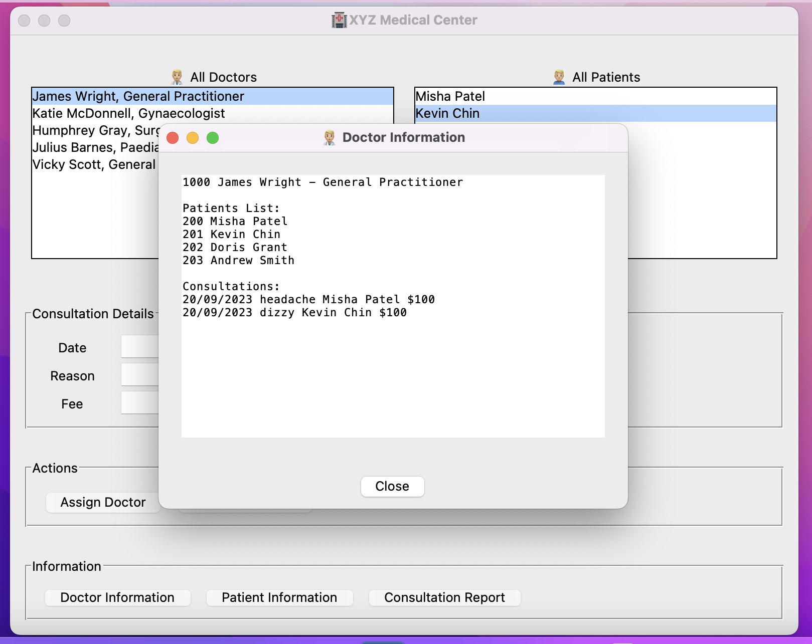
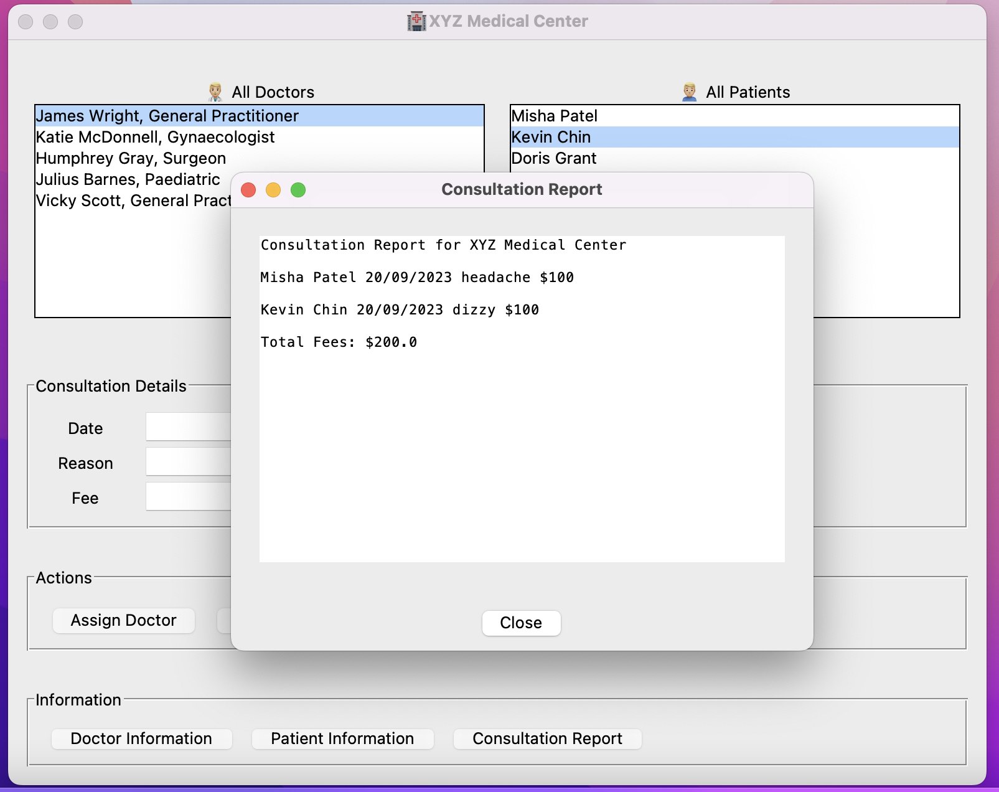

## 🏥 Clinic-System-MVC 🖥️
This is a clinic management system based on the MVC architecture, designed to help medical teams manage and organize patient information more efficiently.

## 📂 Project Structure
Controllers 🎮: Directory containing the main application logic.
Data 📚: Directory for data handling and configurations.
Models 📐: Directory defining the data structures of the application.
Views 🎨: Directory with frontend code and templates.
app.py 🚀: The entry point of the project.
requirements.txt 📝: File listing the project dependencies.

## 🚀 Getting Started
git clone 
pip install -r requirements.txt
python app.py

## Screenshots

